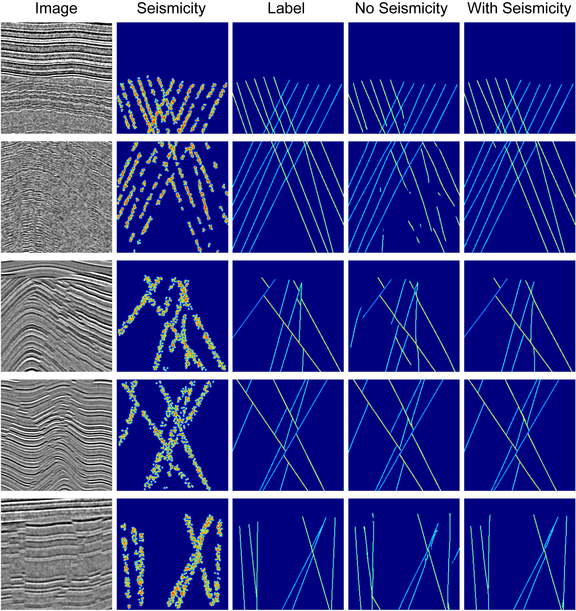

# Description
**SCF: Seismicity-Constrained Fault Detection and Characterization**



Fault detection and characterization is one of center challenges in subsurface characterization. We develop a seismicity-constrained fault detection and characterization based on a multitask machine learning model to leverage both seismic migration image and seismicity location information. The repository contains codes associated with the ML models and the codes for generating training data.

The work was supported by Los Alamos National Laboratory (LANL) Laboratory Directory Research and Development (LDRD) project 20240322ER. LANL is operated by Triad National Security, LLC, for the National Nuclear Security Administration (NNSA) of the U.S. Department of Energy (DOE) under Contract No. 89233218CNA000001. The research used high-performance computing resources provided by LANL's Institutional Computing program.

The work is under LANL open source approval reference O4809.

# Requirement
`SCF` is written with Python, PyTorch, and PyTorch Lightning. Please install these package first.

The data generation depends on [RGM](https://github.com/lanl/rgm), which depends on [FLIT](https://github.com/lanl/flit).

We train the 2D models with a single GPU (NVIDIA RTX 3090). However, to train the 3D models, you will need multiple supercomputing-grade GPUs (e.g., NVIDIA A100), each with more than 40GB memory.


# Use
```
cd scf2
bash run_train.sh
```

or

```
cd scf3
bash run_train.sh
```

# License
&copy; 2024. Triad National Security, LLC. All rights reserved.

This program is Open-Source under the BSD-3 License.

Redistribution and use in source and binary forms, with or without modification, are permitted provided that the following conditions are met:

- Redistributions of source code must retain the above copyright notice, this list of conditions and the following disclaimer.

- Redistributions in binary form must reproduce the above copyright notice, this list of conditions and the following disclaimer in the documentation and/or other materials provided with the distribution.

- Neither the name of the copyright holder nor the names of its contributors may be used to endorse or promote products derived from this software without specific prior written permission.

THIS SOFTWARE IS PROVIDED BY THE COPYRIGHT HOLDERS AND CONTRIBUTORS "AS IS" AND ANY EXPRESS OR IMPLIED WARRANTIES, INCLUDING, BUT NOT LIMITED TO, THE IMPLIED WARRANTIES OF MERCHANTABILITY AND FITNESS FOR A PARTICULAR PURPOSE ARE DISCLAIMED. IN NO EVENT SHALL THE COPYRIGHT HOLDER OR CONTRIBUTORS BE LIABLE FOR ANY DIRECT, INDIRECT, INCIDENTAL, SPECIAL, EXEMPLARY, OR CONSEQUENTIAL DAMAGES (INCLUDING, BUT NOT LIMITED TO, PROCUREMENT OF SUBSTITUTE GOODS OR SERVICES; LOSS OF USE, DATA, OR PROFITS; OR BUSINESS INTERRUPTION) HOWEVER CAUSED AND ON ANY THEORY OF LIABILITY, WHETHER IN CONTRACT, STRICT LIABILITY, OR TORT (INCLUDING NEGLIGENCE OR OTHERWISE) ARISING IN ANY WAY OUT OF THE USE OF THIS SOFTWARE, EVEN IF ADVISED OF THE POSSIBILITY OF SUCH DAMAGE.

# Author
Kai Gao, <kaigao@lanl.gov>

We welcome feedbacks, bug reports, and improvement ideas on `SCF`.

If you use this package in your research and find it useful, please cite it as

* Kai Gao, Ting Chen, 2024, SCF: Seismicity-Constrained Fault Detection and Characterization, url: [github.com/lanl/scf](https://github.com/lanl/scf)
* Kai Gao, Ting Chen, 2024, Seismicity-constrained fault detection and characterization with a multitask machine learning model, submitted.
